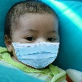

# Fight Against Covid-19 Project
*Written in c++ & tested with ubuntu 20 and MacOs 10.15.7*

## Introduction :

A program wich detects if a person wears a mask correctly with a handcrafted technic, the **LBP**.

The goal of this project is to experiment handcrafted technique instead of more complex and sophisticated algorithm like **Machine Learning** or **DeepLearning** and determine the limit and the viability of the **LBP** on masked face detection.

Local binary patterns (LBP) is a type of visual descriptor used for classification in computer vision. This descriptor is a histogram of 256 value which can be compare with other LBP histogram image to determine if there are similar. 

The dataset I am using is based on this amazing open source project [SaveYourLife](https://github.com/cabani/MaskedFace-Net.). I have resize the original images from **1020x1020px** to **102x102px** for processing speed purpose.

>More info about LBP [here](https://en.wikipedia.org/wiki/Local_binary_patterns).

# Table of Content

* [The Process](#the-process)

* [Result](#result)

* [Conclusion](#conclusion)

* [Run the Program](#run-the-program)

* [Improvement Log](#Improvement-Log)


# The Process

## Rules :

**operator :** ≥

**direction :** Clockwise ( 1 to 8 )


## The Dataset

Contains **10_000 Color** and **10_000 GrayScale** images in **102 x 102 pixel** of people wearing **correctly** or **incorrectly** a mask (the dataset is fairly distributed between correctly/incorrectly masked).

## GrayScale processing :

| Type | Original | LBP |
|:--------:|:---:|:-----------:|
| Image |||

## Color processing :

| Type | Original | LBP Red Layer |  LBP Blue Layer |  LBP Green Layer |
|:--------:|:---:|:-----------:|:-----------:|:-----------:|
| Image ||||||


## Distance Formula

| | SAD | CORRELATION | CHISQUARE | INTERSECTION | BHATTACHARYYA |
|:--------:|:---:|:-----------:|:-----------:|:-----------:|:-----------:|
| **Equation** |sum(abs(H1(i)-H2(i)))|||||
|**Exact Match**|0|1|0|0|0|
|**Missmatch**|+∞|-1|+∞|+∞|+∞|

# Result
## GRAYSCALE TESTING PROCESS

```
Sample :        10_000 / dataset (20 000 images)
Resolution :    102 x 102 pixel
Type:           GrayScale
PC Config : IMac 3.4 GHz i5 4Core / 16 Go DDR4 2400 MHz 
Testing process time :  34 min. 27 sec. / dataset (total 1 hr. 8 min.)
```

| Distance Formula | Sucess Rate TRAIN/TEST 1 | Sucess Rate TRAIN/TEST 2 | TRAIN/TEST 1 & 2 Average |
|:--------------:|:------:|:------:|:------:|
| SumOfAbsDif    | 63.31% | 63.32% | 63.31% |
| Intersect      | 43.21% | 49.24% | 46.22% |
| Chisquare      | 63.96% | 64.21% | 64.08% |
| Bhattacharyya  | 64.39% | 64.2% | 64.30% |
| Correlation    | 60.75% | 60.28% | 60.51% |

## COLOR TESTING PROCESS *in progress..*

```
Sample :        10_000 / dataset (20 000 images)
Resolution :    102 x 102 pixel
Type:           Color (RGB)
PC Config : IMac 3.4 GHz i5 4Core / 16 Go DDR4 2400 MHz 
Testing process time :  1 hr. 35 min. 30 sec. / dataset (total 3 hr. 11 min.)
```

| Distance Formula | Sucess Rate TRAIN/TEST 1 | Sucess Rate TRAIN/TEST 2 | TRAIN/TEST 1 & 2 Average |
|:--------------:|:------:|:------:|:------:|
| Chisquare      | 65.06% | 65.06% | 65.06% |

# Conclusion

Working with color images is a little more efficient than gray images with this dataset. 64 % is not enough to tell that this prediction models is good.

To have better results we must use a higher image resolution and more sample but it will increase the training and testing time.

We can try also an other direction for neighboor discorvery (anticlockwise, ..) for an other histogram distribution.


# Run the program

## Project Structure :

```bash
.
├──  datasets           #The dataset
│        ├── COLOR
│        │     └── descriptor.txt   #Generate after train cmd (contain vector histogramme)
│        ├── GRAY
│        │     └── descriptor.txt   #Idem
├── documentation                   #Documentation (images)
├── build                             #Binary result
├── results                         #Generate after predict cmd (log results)
└── src                             #Source
    ├── formula.cpp                 #Contains distance formula
    ├── main.cpp                    #Parse commande argument and route files
    ├── predict.cpp                 #Prediction logic
    ├── train.cpp                   #Train logic
    ├── utils.cpp                   #Utils function (Mat Image to LBP Histogramme / StringToVector / ...)
```

## Download the dataset

Download the dataset [here](https://mega.nz/file/t4QSUBSa#CWXHd4EXMDo0F454wrQ5Bz4drlk4GeXA_sCh2nMtuic) !

Put the datasets on the root directory **./datasets** folder.
```bash
.
├──  datasets
│        ├── COLOR
│        │     ├── TRAIN1
│        │     ├── TEST1
│        │     ├── TRAIN2
│        │     └── TEST2
│        └── GRAY
├──  out       └── *idem*
└──  src
```

## MacOs
- Install [Homebrew](https://brew.sh/index_fr)

- Install **pkg-config** (*A C/C++ library manager*) & **OpenCv** :
```bash 
brew install pkg-config opencv
```

## Ubuntu

- Install **pkg-config** & **OpenCv**:
```bash 
sudo apt-get install pkg-config libopencv-dev
```

## Check Install :
```bash 
pkg-config opencv4 --cflags 
>> -I/usr/include/opencv4
```

## Compile 

```bash 
mkdir build
cd build
cmake .. && make
```

## Execute

```bash
FightAgainstCovid19/..
Accept only three argument.
    Arguments:
        --type <train|predict> 
            train the model by producing a descriptor or predict the training set with different distance formula
        --mode <color|gray>
            specify the nature of the images
    Example :
        FightAgainstCovid19 -t train -m gray <path_to_dataset>
```

* Exemple: train

```bash 
./build/src/FightAgainstCovid19 -t train -m gray ../../datasets #for grayscale
./build/src/FightAgainstCovid19 -t train -m color ../../datasets #for color
```

* Execute predict

```bash 
./build/src/FightAgainstCovid19 -t predict -m gray ../../datasets #for grayscale
./build/src/FightAgainstCovid19 -t predict -m color ../../datasets #for color
```

# Improvement Log

## 09/11/2020 

**Bug Fix :**
- Neighboord discovery fails, result of an incomplete histogram.
- Some uchar to int convertion fail.

**Logic Change :**
- Human reading direction to Clockwise for Neighboord discovery.

**Performance Improvement :**
- Mat variable type pass by reference in function.
- the vector object decrease the performance of the programme (vector.size() vector.push_back())
vector object replace by simple array in some operation.
- Grayscale Testing Process Time improve by 40min (4 hr. 28 min. -> 3 hr. 40 min.)

**Next Improvement :**
- avoid vector manipulation as much as possible, replace all vector by simple array object.

## 10/11/2020 

**Performance Improvement :**
- Wrong usage of commande make. Replace by Cmake (with release build option enable).
- Replace vector by simple array + array pointeur in all function.
- Grayscale testing process from **3 hr. 40 min.** to **1 hr. 8 min.**
- Color testing process from **10 hr. 22 min.** to **3 hr. 11 min**.

