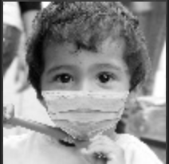

# Fight Against Covid-19 Project
*Written in c++ & tested with ubuntu 20*

A program wich detects if a person wears a mask correctly with the handcrafted machine learning technic, the **LBP**.

The dataset I am using is based on this amazing open source project [SaveYourLife](https://github.com/cabani/MaskedFace-Net.).

# Table of Content

* [LBP Rules](#lbp-rules)

* [The Dataset](#the-dataset)

* [Install C++ Libs dependency](#install-c++-libs-dependency)

* [Compile & Execute](#compile-&-execute)

* [Result](#result)

# LBP Rules

**operator :** ≥

**direction :** ( 1 to 8 )


**process :**

| Original | LBP | Histogramme |
|:--------:|:---:|:-----------:|
||||


More info about LBP [here](https://en.wikipedia.org/wiki/Local_binary_patterns).

# The Dataset
Contains **10_000 Color** and **10_000 GrayScale** images in **102 x 102 pixel** of people wearing **correctly** or **incorrectly** a mask (the dataset is fairly distributed between correctly/incorrectly masked).
Download the dataset [here](https://mega.nz/file/t4QSUBSa#CWXHd4EXMDo0F454wrQ5Bz4drlk4GeXA_sCh2nMtuic) !

Put the datasets on the root directory **./datasets** folder.
```bash
.
├──  datasets
│        ├── COLOR
│        │     ├── TRAIN1
│        │     ├── TEST1
│        │     ├── TRAIN2
│        │     └── TEST2
│        └── GRAY
├──  out       └── *idem*
└──  src
```

# Install C++ Libs dependency
## MacOs
- Install [Homebrew](https://brew.sh/index_fr)

- Install **pkg-config** (*A C/C++ library manager*) & **OpenCv** :
```bash 
brew install pkg-config opencv
```

## Ubuntu

- Install **pkg-config** & **OpenCv**:
```bash 
sudo apt-get install pkg-config libopencv-dev
```

## Check Install :
```bash 
pkg-config opencv4 --cflags 
>> -I/usr/include/opencv4
```

# Compile & Execute

```bash 
mkdir out #to prepare project out directory
```

# With Make

* Compilation Only
```bash 
make
```

* Compile & Execute Train
```bash 
make gt #for grayscale image
<or>
make ct #for color image
```

* Compile & Execute Predict
```bash 
make gp #for grayscale image
<or>
make cp #for color image
```

## With Debug
Use the script for debugging train or predict *.vscode/launch.json*

## Use the Executable
After Compilation you can choose to run the script manualy like that :

* Exemple: Execute Train for grayscale images

```bash 
./out/pbl_masked -t train -m gray ./datasets
```

* Execute Predict for grayscale images

```bash 
./out/pbl_masked -t predict -m gray ./datasets
```

# Result
*in progress*