# Fight Against Covid-19 Project
*Written in c++ & tested with ubuntu 20 and MacOs 10.15.7*

## Introduction :

A program wich detects if a person wears a mask correctly with a handcrafted technic, the **LBP**.

The goal of this project is to experiment handcrafted technique instead of more complex and sophisticated algorithm like **Machine Learning** or **DeepLearning** and determine the limit and the viability of the **LBP** on masked face detection.

Local binary patterns (LBP) is a type of visual descriptor used for classification in computer vision. This descriptor is a histogram of 256 value which can be compare with other LBP histogram image to determine if there are similar. 

The dataset I am using is based on this amazing open source project [SaveYourLife](https://github.com/cabani/MaskedFace-Net.). I have resize the original images from **1020x1020px** to **102x102px** for processing speed purpose.

>More info about LBP [here](https://en.wikipedia.org/wiki/Local_binary_patterns).

# Table of Content

* [The Process](#the-process)

* [Result](#result)

* [Conclusion](#conclusion)

* [Run the Program](#run-the-program)


# The Process

## Rules :

**operator :** ≥

**direction :** ( 1 to 8 )

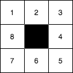

## The Dataset

Contains **10_000 Color** and **10_000 GrayScale** images in **102 x 102 pixel** of people wearing **correctly** or **incorrectly** a mask (the dataset is fairly distributed between correctly/incorrectly masked).

## GrayScale processing :

| Type | Original | LBP |
|:--------:|:---:|:-----------:|
| Image ||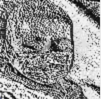|
| Histogram | |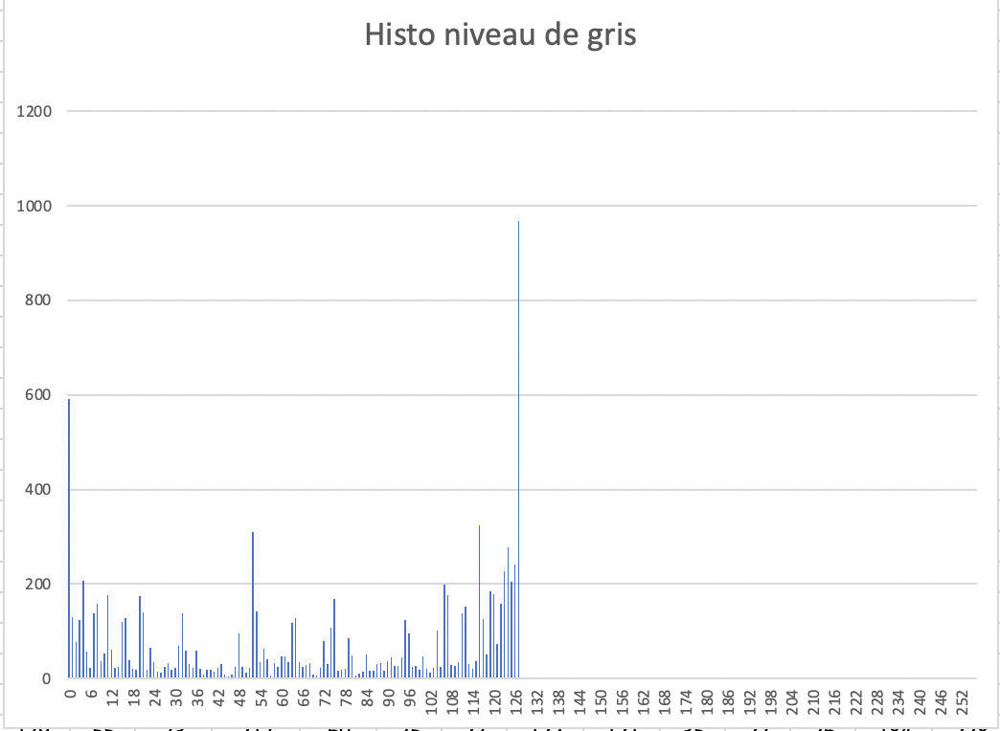|

## Color processing :

| Type | Original | LBP Red Layer |  LBP Blue Layer |  LBP Green Layer |
|:--------:|:---:|:-----------:|:-----------:|:-----------:|
| Image |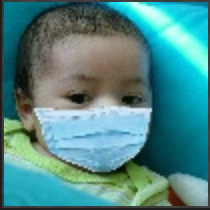|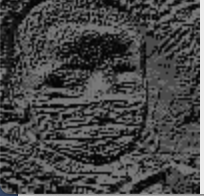|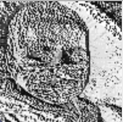|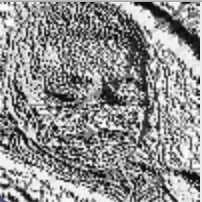|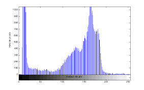|
| Histogram ||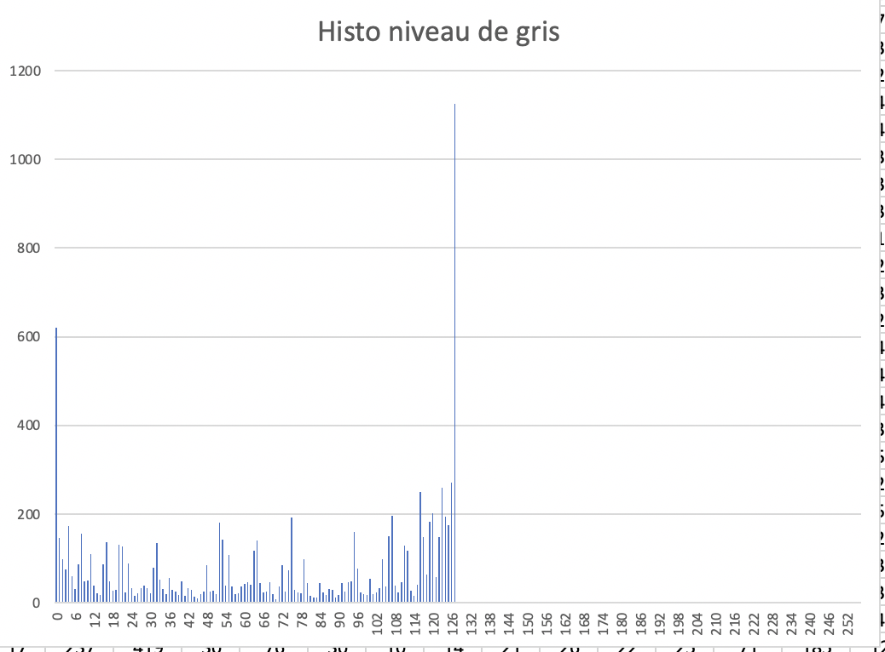|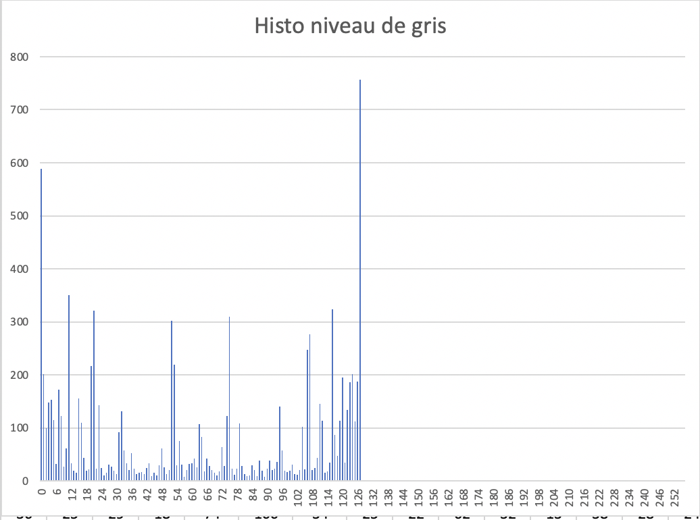|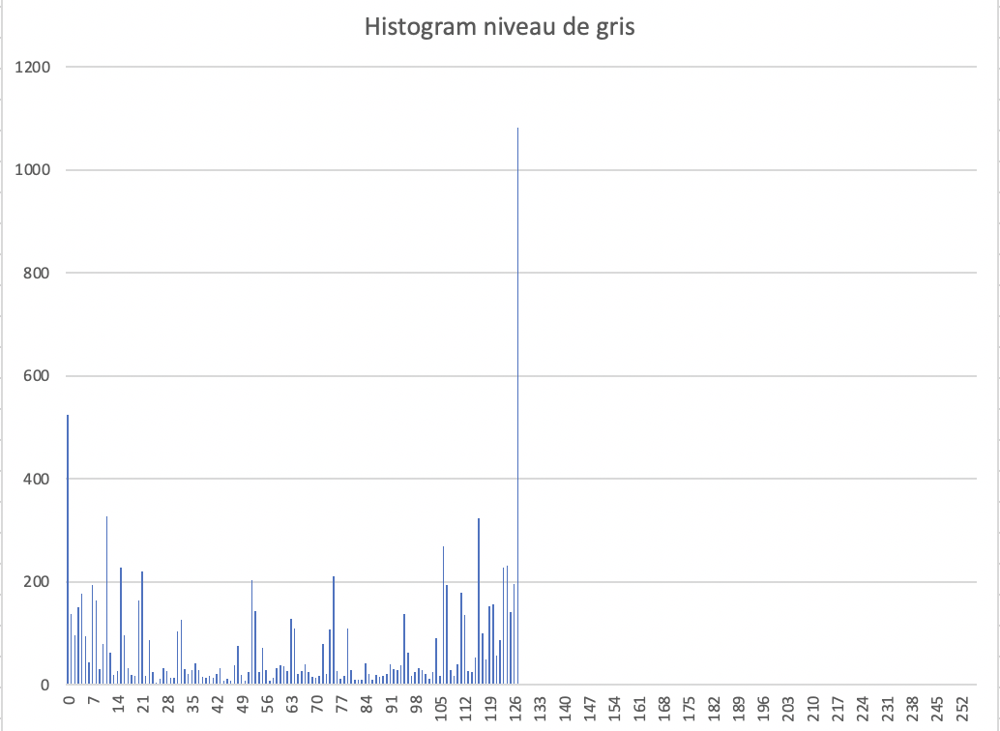|

## Distance Formula

| | SAD | CORRELATION | CHISQUARE | INTERSECTION | BHATTACHARYYA |
|:--------:|:---:|:-----------:|:-----------:|:-----------:|:-----------:|
| **Equation** |sum(abs(H1(i)-H2(i)))|||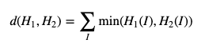|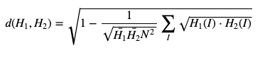|
|**Exact Match**|0|1|0|0|0|
|**Missmatch**|+∞|-1|+∞|+∞|+∞|

# Result
## GRAYSCALE TESTING PROCESS

```
Sample :        10_000 / dataset (20 000 images)
Resolution :    102 x 102 pixel
Type:           GrayScale
PC Config : IMac 3.4 GHz i5 4Core / 16 Go DDR4 2400 MHz 
Testing process time :  4 hr. 29 min. 41 sec. / dataset (total 9 hr.)
```

| Distance Formula | Sucess Rate TRAIN/TEST 1 | Sucess Rate TRAIN/TEST 2 | TRAIN/TEST 1 & 2 Average |
|:--------------:|:------:|:------:|:------:|
| SumOfAbsDif    | 62.24% | 62.14% | 62.19% |
| Intersect      | 43.71% | 49.28% | 46.49% |
| Chisquare      | 63.31% | 63.57% | 63.44% |
| Bhattacharyya  | 63.36% | 63.25% | 63.30% |
| Correlation    | 60.52% | 60.49% | 60.50% |

## COLOR TESTING PROCESS

```
Sample :        10_000 / dataset (20 000 images)
Resolution :    102 x 102 pixel
Type:           Color (RGB)
PC Config : IMac 3.4 GHz i5 4Core / 16 Go DDR4 2400 MHz 
Testing process time :  10 hr. 28 min. / dataset (total 20 hr.)
```

| Distance Formula | Sucess Rate TRAIN/TEST 1 | Sucess Rate TRAIN/TEST 2 | TRAIN/TEST 1 & 2 Average |
|:--------------:|:------:|:------:|:------:|
| Chisquare      | 64.05% | 64.55% | 64.30% |

# Conclusion

Working with color images is a little more efficient than gray images with this dataset. 64 % is not enough to tell that this prediction models is good.

To have better results we must use a higher image resolution and more sample but it will increase the training and testing time.

# Run the program

## Project Structure :

```bash
.
├──  datasets           #The dataset
│        ├── COLOR
│        │     └── descriptor.txt   #Generate after train cmd (contain vector histogramme)
│        ├── GRAY
│        │     └── descriptor.txt   #Idem
├── documentation                   #Documentation (images)
├── out                             #Binary result
├── results                         #Generate after predict cmd (log results)
└── src                             #Source
    ├── formula.cpp                 #Contains distance formula
    ├── main.cpp                    #Parse commande argument and route files
    ├── predict.cpp                 #Prediction logic
    ├── train.cpp                   #Train logic
    ├── utils.cpp                   #Utils function (Mat Image to LBP Histogramme / StringToVector / ...)
```

## Download the dataset

Download the dataset [here](https://mega.nz/file/t4QSUBSa#CWXHd4EXMDo0F454wrQ5Bz4drlk4GeXA_sCh2nMtuic) !

Put the datasets on the root directory **./datasets** folder.
```bash
.
├──  datasets
│        ├── COLOR
│        │     ├── TRAIN1
│        │     ├── TEST1
│        │     ├── TRAIN2
│        │     └── TEST2
│        └── GRAY
├──  out       └── *idem*
└──  src
```

## MacOs
- Install [Homebrew](https://brew.sh/index_fr)

- Install **pkg-config** (*A C/C++ library manager*) & **OpenCv** :
```bash 
brew install pkg-config opencv
```

## Ubuntu

- Install **pkg-config** & **OpenCv**:
```bash 
sudo apt-get install pkg-config libopencv-dev
```

## Check Install :
```bash 
pkg-config opencv4 --cflags 
>> -I/usr/include/opencv4
```

# Compile & Execute

* Compilation Only
```bash 
make
```
# With Make

* Compile & Execute Train
```bash 
make gt #for grayscale image
<or>
make ct #for color image
```

* Compile & Execute Predict
```bash 
make gp #for grayscale image
<or>
make cp #for color image
```

## With VsCode (DEBUG)

Use the script for debugging train or predict *.vscode/launch.json*.
The debug use make .

## With Only the Executable

After Compilation you can choose to run the script manualy like that :

* Exemple: Execute Train for grayscale images

```bash 
./out/pbl_masked -t train -m gray ./datasets
```

* Execute Predict for grayscale images

```bash 
./out/pbl_masked -t predict -m gray ./datasets
```
